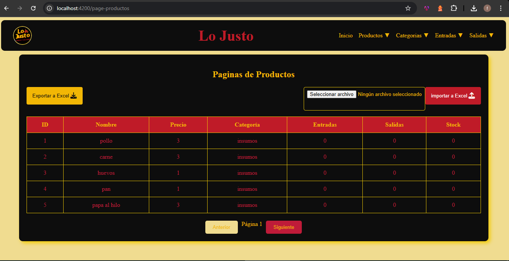
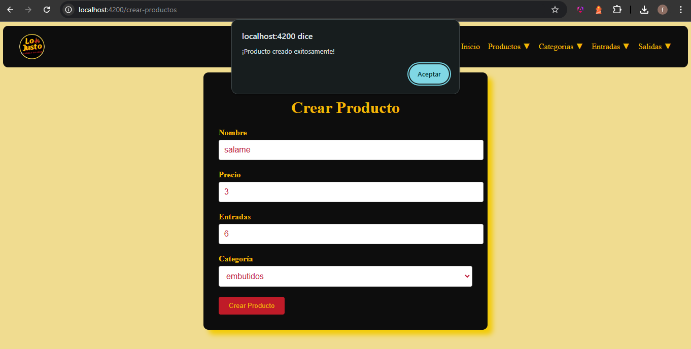

# Sistema de Gestión de Inventario (Frontend)

## Descripción del Proyecto

Este es un sistema de gestión de inventario desarrollado con Angular, diseñado para facilitar el control y seguimiento de productos, categorías, entradas y salidas de stock.

## Demo
Aquí hay una demostración en vivo que funciona: [lojusto.netlify.app](https://lojusto.netlify.app).

Estas son algunas imagenes de como se ve la aplicacion **Inventario LoJusto**:  

Añadir nuevo Producto

## Características Principales

### Gestión de Productos
- Crear nuevos productos
- Listar productos
- Actualizar información de productos
- Eliminar productos
- Buscar productos por categoría
- Paginación de productos

### Gestión de Categorías
- Crear categorías
- Listar categorías
- Actualizar categorías
- Eliminar categorías
- Paginación de categorías

### Control de Stock
- Registrar entradas de productos
- Registrar salidas de productos
- Buscar entradas y salidas por fecha
- Exportar e importar datos de stock mediante archivos Excel

## Tecnologías Utilizadas

- Angular 16.2.0
- RxJS
- TypeScript
- HttpClient para comunicación con backend
- Font Awesome para iconos

## Dependencias Principales

- `@angular/core`
- `@angular/forms`
- `@angular/router`
- `rxjs`
- `file-saver` para exportaciones a excel
- `@fortawesome/fontawesome-free`

## Requisitos del Sistema

- `Node.js 16+`
- `npm 8+`
- `Angular CLI`
- `Navegador moderno (Chrome, Firefox, Edge)`

## Rutas Disponibles

- `/page-productos`: Listado paginado de productos
- `/page-categorias`: Listado paginado de categorías
- `/crear-productos`: Formulario para crear productos
- `/crear-categorias`: Formulario para crear categorías
- `/registrar-entrada`: Registrar entradas de stock
- `/registrar-salida`: Registrar salidas de stock

## Funcionalidades de Exportación/Importación

- Exportar productos a Excel
- Exportar entradas a Excel
- Exportar salidas a Excel
- Importar productos desde archivo Excel
